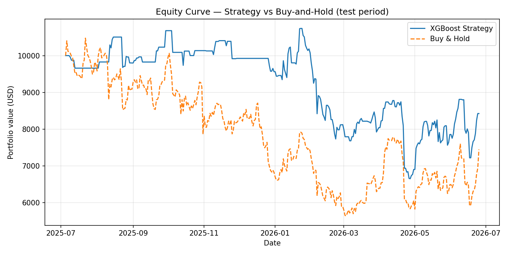
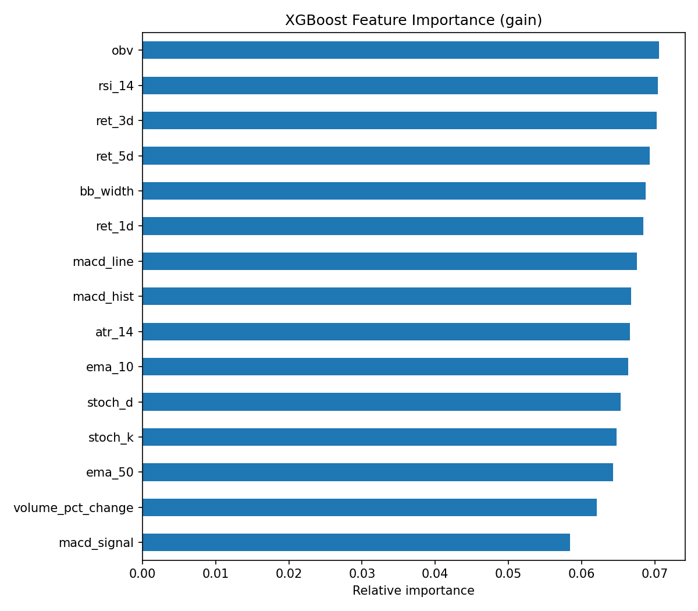

# BTC Direction Classifier — XGBoost + Backtest

A binary classifier that predicts next-day Bitcoin price direction (up / down)
using XGBoost on technical indicator features, evaluated with an honest
walk-forward backtest.

Built as a portfolio project demonstrating practical ML skills for algorithmic
trading.  Results are intentionally **not** cherry-picked — daily crypto
direction prediction is hard, and the limitations section says why.

---

## Methodology

```
Raw OHLCV data (yfinance)
   ↓
Feature engineering (pandas-ta)
   ↓
Chronological 80/20 train/test split
   ↓
XGBClassifier (binary:logistic)
   ↓
Evaluate: accuracy, F1, ROC-AUC + baselines
   ↓
Vectorised backtest (long/flat) vs buy-and-hold
```

### Data

- Source: Yahoo Finance via `yfinance` (5 years of daily BTC-USD OHLCV)
- Cached locally to `data/btc_daily.csv` after first download

### Features (all computed at time *t*, no look-ahead)

| Group | Features |
|-------|---------|
| Trend | EMA(10), EMA(50), MACD line/signal/histogram |
| Momentum | RSI(14), Stochastic %K/%D |
| Volatility | ATR(14), Bollinger Band width |
| Volume | OBV, volume % change |
| Lagged returns | 1-day, 3-day, 5-day pct change |

Target: `1` if `close[t+1] > close[t]`, else `0`.  Last row dropped (no label).
NaN rows from indicator warm-up are dropped.

### Model

`XGBClassifier` with conservative hyperparameters (max_depth=4, lr=0.05,
min_child_weight=5) to avoid overfitting the small test set.  Hyperparameters
were **not** tuned on the test set.

### Backtest

Long/flat strategy: hold BTC when model predicts "up", stay in cash otherwise.
Uses vectorised returns — no transaction costs modelled (see Limitations).

---

## Results

> Replace the placeholder values below after running `python src/backtest.py`.

### Classification Metrics (test set)

| Metric | XGBoost | Always-Up baseline | Random baseline |
|--------|---------|--------------------|-----------------|
| Accuracy | — | — | 0.50 |
| Precision | — | — | — |
| Recall | — | — | — |
| F1 | — | — | — |
| ROC-AUC | — | — | — |

### Backtest Metrics (test period)

| Metric | XGBoost Strategy | Buy & Hold |
|--------|-----------------|------------|
| Total Return | — | — |
| Annualised Return | — | — |
| Sharpe Ratio | — | — |
| Max Drawdown | — | — |
| Win Rate | — | — |

### Equity Curve



### Feature Importance



---

## Limitations & Honest Discussion

**Why daily crypto direction is hard:**
- Markets are efficient enough that simple technical signals have near-zero
  edge.  A 52–54% accuracy is realistic; anything higher on a held-out test
  set deserves scrutiny for leakage.
- The BTC regime changes drastically (bull, bear, sideways, halving cycles).
  A model trained on one regime generalises poorly to another.

**What this project doesn't model:**
- **Transaction costs / slippage** — real execution would require bid-ask
  spread, exchange fees (~0.05–0.1% per trade), and market impact.  These
  compound significantly for a daily strategy and would reduce reported returns.
- **Funding rates / borrow costs** — not applicable here (long-only, spot),
  but relevant for any futures or margin strategy.
- **Tax drag** — frequent rebalancing triggers taxable events in many jurisdictions.

**What could be improved:**
- *Intraday data* (1h / 4h bars) — more signal observations, but also more
  computational cost and worse survivorship bias risk.
- *Regime detection* — HMM or change-point detection to switch between
  trend-following and mean-reversion models.
- *Alternative data* — on-chain metrics (NUPL, SOPR), funding rates, social
  sentiment.
- *Ensemble methods* — stacking XGBoost with LSTM or Temporal Fusion
  Transformer.
- *Walk-forward validation* — rolling re-training to avoid the single
  train/test boundary being lucky or unlucky.
- *SHAP values* — for model interpretability beyond aggregate importance scores.

---

## Setup & Usage

### 1. Install dependencies

```bash
pip install -r requirements.txt
```

### 2. Download data

```bash
python src/data_loader.py
```

### 3. Train model & evaluate

```bash
python src/model.py
```

### 4. Run full pipeline (data → features → model → backtest)

```bash
python src/backtest.py
```

### 5. Explore in the notebook

```bash
jupyter notebook notebooks/01_eda_features.ipynb
```

Results are written to `results/`:
- `metrics.json` — classification + backtest metrics
- `equity_curve.png` — strategy vs buy-and-hold
- `feature_importance.png` — XGBoost gain-based importance
- `confusion_matrix.png` — test-set confusion matrix

---

## Project Structure

```
tradeXGB/
├── data/
│   └── btc_daily.csv          # auto-generated after first run
├── notebooks/
│   └── 01_eda_features.ipynb  # EDA and feature walkthrough
├── src/
│   ├── data_loader.py         # yfinance download + cache
│   ├── features.py            # indicator computation + target creation
│   ├── model.py               # XGBoost train + evaluate
│   └── backtest.py            # vectorised long/flat backtest
├── results/                   # auto-generated plots and metrics
├── README.md
└── requirements.txt
```

---

## Author

Sergei Andrievski — Process Engineer → ML Engineer / Fintech ML
PhD candidate, CTU Prague
