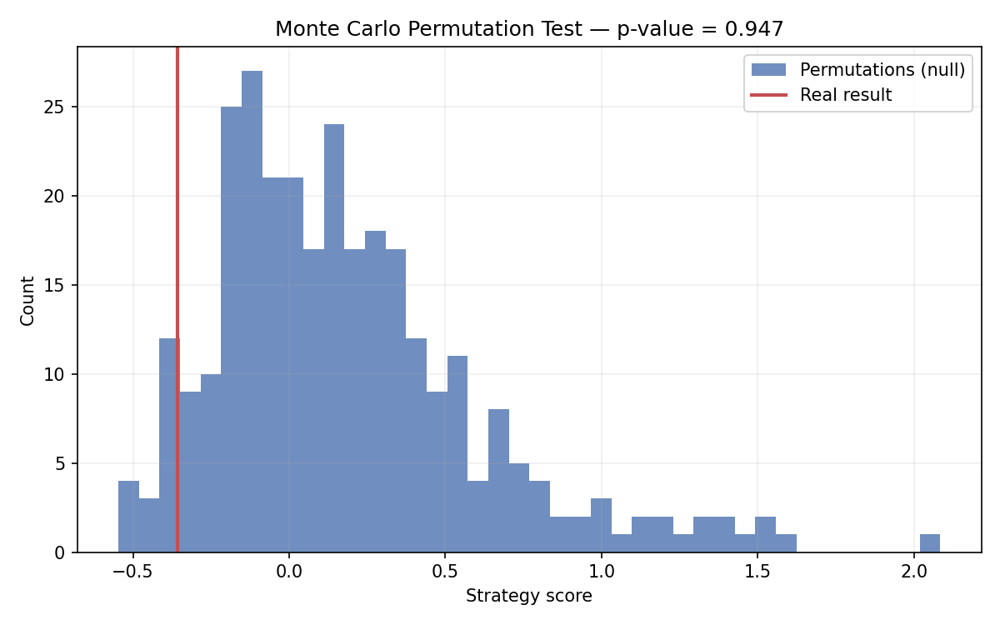

# BTC Direction Classifier — XGBoost + Backtest + Statistical Validation

A binary classifier that predicts next-day Bitcoin price direction (up / down)
using XGBoost on technical-indicator features, evaluated with an honest
walk-forward backtest **and a Monte Carlo permutation test** for statistical
significance.

The result is deliberately not cherry-picked. Daily crypto direction prediction
is one of the hardest forecasting problems there is, and the whole point of the
project is methodological rigour: a correct, leakage-free pipeline and an honest
verdict on whether any edge actually exists. (Spoiler: it doesn't — and the
project proves that statistically rather than hand-waving it.)

---

## Headline result

| Check | Outcome |
| --- | --- |
| Test-set ROC-AUC | **0.487** — essentially chance |
| Strategy vs buy-and-hold | Both negative over a bearish test window |
| Monte Carlo permutation test | **p = 0.95** — result indistinguishable from noise |

Three independent signals agree: there is no predictable daily edge in these
features. That agreement is the deliverable.

---

## Methodology

```
Raw OHLCV (yfinance, 5y daily BTC-USD)
   --> Feature engineering (pandas-ta), all computed at time t
   --> Chronological 80/20 train/test split (no shuffling)
   --> XGBClassifier (binary:logistic), conservative hyper-parameters
   --> Evaluate: accuracy, F1, ROC-AUC vs baselines
   --> Vectorised long/flat backtest vs buy-and-hold
   --> Monte Carlo permutation test for statistical significance
```

### Data

Yahoo Finance via `yfinance` — five years of daily BTC-USD OHLCV, cached to
`data/btc_daily.csv` after first download.

### Features

All features use only information available up to and including time *t*.

| Group | Features |
| --- | --- |
| Trend | EMA(10), EMA(50), MACD line / signal / histogram |
| Momentum | RSI(14), Stochastic %K / %D |
| Volatility | ATR(14), Bollinger Band width |
| Volume | OBV, volume % change |
| Lagged returns | 1-day, 3-day, 5-day pct change |

**Target:** `1` if `close[t+1] > close[t]`, else `0`. The last row (no label) is
dropped, along with NaN rows from indicator warm-up.

### Model

`XGBClassifier` with conservative hyper-parameters (`max_depth=4`,
`learning_rate=0.05`, `min_child_weight=5`, regularisation on) to resist
overfitting the small test set. Hyper-parameters were **not** tuned on the test
set.

### Backtest

Long/flat: hold BTC when the model predicts "up" on the prior day, otherwise sit
in cash. The signal is shifted by one bar so a prediction made on day *t* only
affects the return earned on day *t+1* — this prevents look-ahead. Transaction
costs are not modelled (see Limitations).

---

## Results

### Classification metrics (test set, n = 356)

| Metric | XGBoost | Always-Up baseline | Random baseline |
| --- | --- | --- | --- |
| Accuracy | 0.503 | 0.472 | 0.500 |
| Precision | 0.483 | — | — |
| Recall | 0.738 | — | — |
| F1 | 0.584 | — | — |
| ROC-AUC | 0.487 | — | 0.500 |

The high recall with near-chance precision shows the model mostly defaults to
predicting "up" — it has not learned a useful signal. ROC-AUC below 0.5 confirms
no class-separating power.

### Backtest metrics (test period)

| Metric | XGBoost strategy | Buy & Hold |
| --- | --- | --- |
| Total return | −35.9% | −44.8% |
| Annualised return | −36.6% | −45.6% |
| Sharpe ratio | −0.97 | −1.19 |
| Max drawdown | −46.0% | −52.1% |
| Win rate | 48.4% | 47.3% |

The strategy "lost less" than buy-and-hold only because it was in cash more often
during a falling market — that is reduced exposure, not alpha.

### Statistical validation — Monte Carlo permutation test

Backtest numbers alone can't tell you whether a result reflects skill or luck on
one slice of history. The MCPT answers that directly:

1. Run the full pipeline on the real prices — record the result.
2. Build hundreds of permuted price series. Each preserves the *distribution* of
   bar-to-bar moves (same volatility, same building blocks) but **shuffles their
   time order**, destroying any real temporal pattern.
3. Re-run the full pipeline (recomputing features, retraining XGBoost,
   backtesting) on every permutation.
4. **p-value** = fraction of permuted runs that did at least as well as the real
   run.

The permutation engine is adapted from the
[neurotrader888/mcpt](https://github.com/neurotrader888/mcpt) framework, extended
to this project's data format and to permute volume consistently with each bar's
price move. Using a vetted method here is a deliberate choice — reach for the
right proven tool rather than reinvent a statistical test.

**Result: p = 0.95** over 300 permutations. The real result sits in the lower
tail of the null distribution — it is statistically indistinguishable from
noise. (It lands low because the real test window trended downward against the
model's long bias, whereas permuted series have no sustained trend.)



### Plots


---

## Limitations & honest discussion

**Why daily crypto direction is hard.** Markets are efficient enough that simple
technical signals carry near-zero edge. A 52–54% accuracy would be a realistic
ceiling; anything higher on a held-out set should be scrutinised for leakage. BTC
regimes also shift drastically (bull, bear, sideways, halving cycles), so a model
trained on one regime generalises poorly to another.

**What this project doesn't model.** Transaction costs and slippage (exchange
fees ~0.05–0.1% per trade compound heavily for a daily strategy); funding/borrow
costs (n/a here — long-only spot); tax drag from frequent rebalancing.

**On the permutation test.** Global bar-shuffling destroys volatility clustering
along with everything else, so the null hypothesis is "no temporal structure at
all". A stricter variant could preserve volatility clustering via block
permutation — a possible extension.

**What could be improved.** Intraday bars for more signal observations; regime
detection (HMM / change-point) to switch models; on-chain or sentiment features;
rolling walk-forward retraining; SHAP values for interpretability.

---

## Setup & usage

```bash
pip install -r requirements.txt

python src/data_loader.py   # download + cache data
python src/model.py         # train + evaluate
python src/backtest.py      # full pipeline: data -> features -> model -> backtest
python src/run_mcpt.py      # statistical validation (retrains per permutation; minutes)
```

Outputs are written to `results/`: `metrics.json`, `equity_curve.png`,
`feature_importance.png`, `confusion_matrix.png`, `mcpt_histogram.png`.

---

## Project structure

```
tradeXGB/
├── data/
│   └── btc_daily.csv          # auto-generated after first run
├── notebooks/
│   └── 01_eda_features.ipynb  # EDA and feature walkthrough
├── src/
│   ├── data_loader.py         # yfinance download + cache
│   ├── features.py            # indicator computation + target creation
│   ├── model.py               # XGBoost train + evaluate
│   ├── backtest.py            # vectorised long/flat backtest
│   ├── mcpt_test.py           # permutation engine + MCPT driver
│   └── run_mcpt.py            # runs MCPT on the real strategy
├── results/                   # auto-generated plots and metrics
├── README.md
└── requirements.txt
```

---

## Author

Serhii Andriievskyi — PhD candidate, CTU Prague.